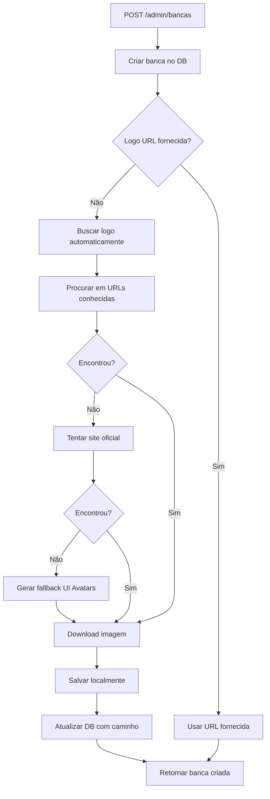

# Sistema Automático de Logos - MemoDrops

## 📋 Visão Geral

Sistema implementado para buscar, baixar e armazenar automaticamente logos das bancas de concursos quando são criadas no sistema. Elimina a necessidade de inserção manual de URLs de logos e garante que as imagens sejam servidas do mesmo domínio, evitando problemas de CORS.

## 🎯 Objetivos Alcançados

- ✅ Busca automática de logos ao criar nova banca
- ✅ Download e armazenamento local de imagens
- ✅ Fallback para logos não encontradas (UI Avatars)
- ✅ Servir arquivos estáticos via Fastify
- ✅ Script de backfill para bancas existentes
- ✅ Integração transparente na API

## 🏗️ Arquitetura

### Componentes Implementados

1. **Serviço de Logo Fetcher** (`src/services/logo-fetcher.ts`)
   - Busca URLs de logos conhecidas
   - Tenta buscar no site oficial da banca
   - Gera fallback com UI Avatars
   - Download e salvamento local

2. **Configuração de Arquivos Estáticos** (`src/server.ts`)
   - Plugin `@fastify/static` configurado
   - Serve arquivos de `/public`
   - Logos acessíveis via `/logos/bancas/`

3. **Integração na API** (`src/routes/admin.bancas.ts`)
   - POST `/admin/bancas` busca logo automaticamente
   - Processo não bloqueia criação de banca
   - Atualiza registro com caminho local

4. **Script de Backfill** (`scripts/backfill-logos.ts`)
   - Atualiza logos de bancas existentes
   - Processa uma banca por vez
   - Delay entre requisições (rate limiting)

## 📁 Estrutura de Arquivos

```
MemoaDrops-2/
├── public/
│   └── logos/
│       └── bancas/
│           ├── ibam-28.png
│           ├── fgv-1.png
│           └── ...
├── src/
│   ├── server.ts (configuração static files)
│   ├── services/
│   │   └── logo-fetcher.ts (serviço principal)
│   └── routes/
│       └── admin.bancas.ts (integração API)
└── scripts/
    └── backfill-logos.ts (script de atualização)
```

## 🔧 Funcionamento Técnico

### 1. Busca de Logos

O sistema utiliza múltiplas estratégias para encontrar logos:

#### a) Mapeamento de URLs Conhecidas
```typescript
const knownLogos: Record<string, string> = {
  'fgv': 'https://portal.fgv.br/sites/portal.fgv.br/files/logo-fgv-portal.png',
  'cesgranrio': 'https://www.cesgranrio.org.br/img/institucional/logo-cesgranrio.png',
  // ... outras bancas
};
```

#### b) Busca no Site Oficial
Se a banca tem website cadastrado, tenta URLs comuns:
- `/logo.png`
- `/img/logo.png`
- `/images/logo.png`
- `/assets/logo.png`
- etc.

#### c) Fallback - UI Avatars
Se não encontrar logo, gera imagem com iniciais:
```
https://ui-avatars.com/api/?name=IBAM&size=200&background=0D47A1&color=fff&bold=true
```

### 2. Download e Armazenamento

```typescript
// Nome do arquivo: {nome-sanitizado}-{id}.png
// Exemplo: ibam-28.png, fundacao-getulio-vargas-1.png

const filename = `${sanitizedName}-${bancaId}.png`;
const absolutePath = path.join(LOGOS_DIR, filename);
const relativePath = `/logos/bancas/${filename}`;
```

### 3. Servir Arquivos Estáticos

```typescript
await app.register(fastifyStatic, {
  root: path.join(__dirname, '../public'),
  prefix: '/',
});
```

Logos acessíveis em:
```
https://api-production-5ffc.up.railway.app/logos/bancas/ibam-28.png
```

## 📊 Fluxo de Criação de Banca



## 🚀 Como Usar

### Criar Nova Banca (Automático)

```bash
POST /admin/bancas
{
  "name": "ibam",
  "display_name": "IBAM",
  "short_name": "IBAM",
  "areas": ["federal"]
}
```

O sistema automaticamente:
1. Cria a banca
2. Busca o logo
3. Baixa e salva localmente
4. Atualiza o registro

### Executar Backfill (Bancas Existentes)

```bash
cd /home/ubuntu/MemoaDrops-2
pnpm run build
node dist/scripts/backfill-logos.js
```

## ⚠️ Limitações e Considerações

### 1. Persistência de Arquivos no Railway

**PROBLEMA**: O Railway não persiste arquivos salvos no filesystem entre deploys.

**IMPACTO**: Logos baixados são perdidos a cada novo deploy.

**SOLUÇÕES POSSÍVEIS**:

#### Opção A: Railway Volumes (Recomendado)
- Armazenamento persistente do Railway
- Montado em `/public/logos`
- Sobrevive a deploys
- Custo adicional

#### Opção B: S3/Cloud Storage
- Armazenar logos em AWS S3, Cloudflare R2, etc.
- Modificar `logo-fetcher.ts` para upload
- Servir via CDN
- Melhor performance global

#### Opção C: Regenerar em Cada Deploy
- Executar backfill automaticamente após deploy
- Usar Railway `postDeploy` hook
- Mais lento, mas funciona

### 2. Rate Limiting

O script de backfill inclui delay de 1 segundo entre requisições para evitar bloqueios:

```typescript
await new Promise(resolve => setTimeout(resolve, 1000));
```

### 3. Certificados SSL

Alguns sites podem ter certificados inválidos. O código usa:

```typescript
headers: {
  'User-Agent': 'Mozilla/5.0 ...'
}
```

Para evitar bloqueios, mas alguns sites ainda podem falhar.

## 📝 Próximos Passos

### Curto Prazo
1. ✅ Implementar sistema básico de logos
2. ⏳ Configurar Railway Volume para persistência
3. ⏳ Executar backfill para todas as bancas
4. ⏳ Testar logos no frontend

### Médio Prazo
1. Implementar cache de logos
2. Adicionar endpoint para atualizar logo manualmente
3. Implementar validação de imagens (formato, tamanho)
4. Adicionar suporte a SVG

### Longo Prazo
1. Migrar para S3/CDN
2. Implementar busca inteligente de logos (Google Images API)
3. Adicionar sistema de moderação de logos
4. Implementar compressão automática de imagens

## 🔍 Debugging

### Ver Logs do Logo Fetcher

No Railway, acesse:
```
Logs > Filter: "Buscando logo" ou "Logo salva"
```

### Verificar Arquivos Localmente

```bash
ls -la /home/ubuntu/MemoaDrops-2/public/logos/bancas/
```

### Testar Download Manual

```bash
curl -I https://api-production-5ffc.up.railway.app/logos/bancas/ibam-28.png
```

## 📚 Referências

- [Fastify Static Plugin](https://github.com/fastify/fastify-static)
- [UI Avatars API](https://ui-avatars.com/)
- [Railway Volumes](https://docs.railway.app/reference/volumes)
- [Axios Streaming](https://axios-http.com/docs/res_schema)

## 🤝 Contribuindo

Para adicionar suporte a novas bancas no mapeamento de URLs conhecidas:

1. Edite `src/services/logo-fetcher.ts`
2. Adicione entrada em `knownLogos`:
```typescript
'nova-banca': 'https://www.novabanca.com.br/logo.png',
```
3. Teste com script de backfill
4. Commit e push

## 📄 Licença

Este sistema faz parte do projeto MemoDrops e segue a mesma licença do projeto principal.

---

**Última atualização**: 12 de novembro de 2025
**Versão**: 1.0.0
**Autor**: Sistema MemoDrops
